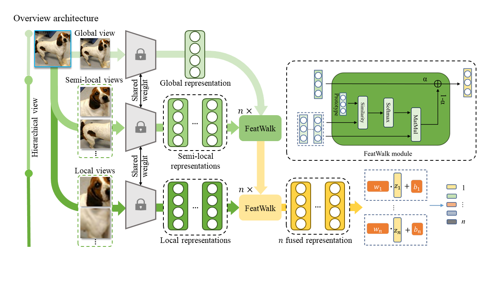

# Hierarchical Featwalk

This is a face recognition application built using Python, [Face-Recognition API](https://github.com/ageitgey/face_recognition) and Streamlit framework. The app allows users to upload an image containing faces and performs face recognition using the face recognition library.

This is a modified version of the original [FeatWalk architecture](https://github.com/exceefind/FeatWalk) served for our Computer Vision course, the original work is a very nice work, you can check out yourself. In this version, we proposed a new branch beyond local view named semi-local view as a new filter which allows FeatWalk module is able to attend on correct local patch, so enrich the final feature for the classifier. 

## Features

- Hierarchical architecture: Global view -> Semi-local -> Local view (origin: Global view -> Local view)
- Improve the performance compared to orginal FeatWalk
- Simple yet more efficient
- Dirty code

## Architecture 



## Compare to the baseline 
### miniImageNet dataset
| Method   | Backbone | 5-way 1-shot   | 5-way 5-shot |
|----------|----------|----------------|--------------|
|FeatWalk  | ResNet-12|70.21±0.44      | 87.38±0.27   |
| Ours     | ResNet-12|74.83±0.41 (+4.62)|87.68±0.29 (+0.3)|

### CUB dataset

| Method   | Backbone | 5-way 1-shot   | 5-way 5-shot |
|----------|----------|----------------|--------------|
|FeatWalk  | ResNet-18|85.67±0.38      | 95.44±0.16   |
| Ours     | ResNet-18|88.07±0.33 (+2.4)|95.62±0.34 (+0.18)|
## Requirements 
- Python 3.11 

## Repository structure
```bash
├───data
│   │───datamgr.py
│   │───dataset.py
├───methods
│   ├───bdc_module.py
│   ├───stl_deepbdc.py
│   ├───template.py
│   └───FeatWalk.py
├───network
│   └───resnet.py
│───utils
│   ├───loss.py
│   └───utils.py
├───README.md 
├───eval.py
└───run.sh
```

## Description
- **data**: Contains data-related scripts for managing datasets and preparing inputs for training and evaluation..
- **methods**: Implements the core algorithms, including the FeatWalk method and other baseline or complementary modules relevant to few-shot learning.
- **network**: Defines neural network architectures such as ResNet used as feature extractors.
- **utils**: Provides supporting utilities like loss functions and helper methods for various tasks.
- **eval.py**: A standalone evaluation script to test model performance on specified datasets..
- **run.sh**: A shell script to streamline running experiments or training sessions.
- **requirement.txt**: required packages.


## Installation
1. Clone the repository
```bash
git clone https://github.com/datct00/Hierarchical-FeatWalk.git
cd Hierarchical-FeatWalk
```

2. Install the dependencies
```bash
pip install -r requirements.txt
```

3. Prepare dataset 
Please refer to the original work of [FeatWalk](https://github.com/exceefind/FeatWalk?tab=readme-ov-file#preparation-before-running)

4. Run
Please refer to the original work for more detail [Here](https://github.com/exceefind/FeatWalk?tab=readme-ov-file#running-commands)
```bash
sh run.sh
```

##Acknowledgments
This project builds upon and extends the work presented in the FeatWalk repository, authored by Dalong Chen et al. Their innovative FeatWalk module for enhancing few-shot classification by leveraging local views has been foundational to this implementation. We gratefully acknowledge their contributions to advancing few-shot learning research and providing a well-documented and accessible codebase.

For more details and original usage instructions, please refer to their official repository:
https://github.com/exceefind/FeatWalk

## Contact
If you have any questions, feel free to contact me via email: `chungtiendat8102000@gmail.com`
